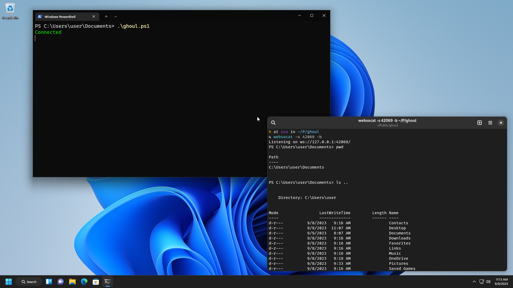

# ghoul
Powershell reverse shell via WebSockets

> [!IMPORTANT]
> The code in this repository is a proof of concept.
> The end user is solely liable for their actions.
> Read the [license](https://github.com/lavafroth/cloakshell/blob/main/LICENSE) for more details.



### Prerequisites

- [Websocat](https://github.com/vi/websocat) installed
- A Windows VM

#### Quickstart

On the host machine, spin up a listener.

```sh
websocat -s 42069 -b
```

In `ghoul.ps1`, change the IP address for the `$endpoint` variable to your host's IP address.
Now run it in the VM.

```
.\ghoul.ps1
```
